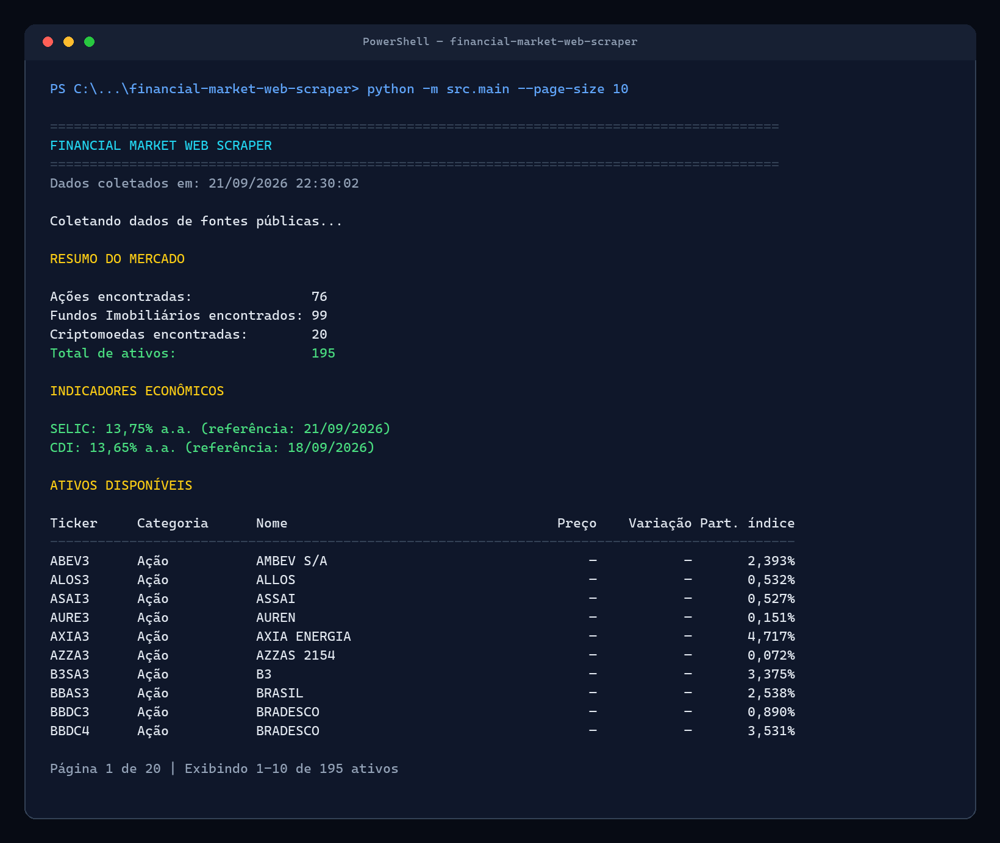
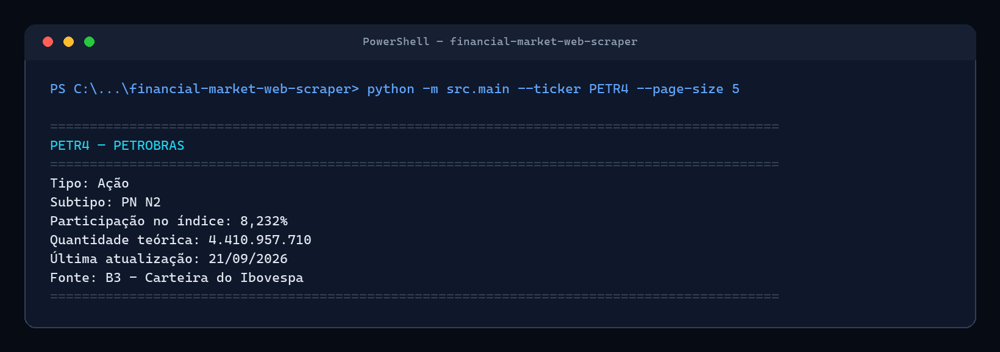
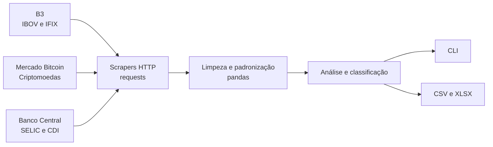
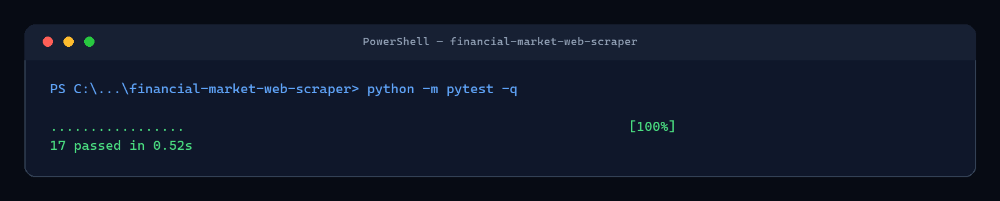

# Financial Market Web Scraper

[](https://github.com/bonitin-sama/financial-market-web-scraper/actions/workflows/tests.yml)

[](https://github.com/bonitin-sama/financial-market-web-scraper/releases)
[](LICENSE)

Projeto em Python para coletar, padronizar, analisar e exportar dados públicos
do mercado financeiro brasileiro. A aplicação utiliza requisições HTTP diretas
com `requests`, transforma respostas JSON em `DataFrame` com `pandas` e oferece
uma interface de terminal para consulta e filtragem dos ativos.

O projeto foi desenvolvido para um processo seletivo de estágio. A arquitetura
prioriza funções pequenas, responsabilidades claras, tratamento de erros e
decisões que possam ser explicadas integralmente em uma entrevista técnica.

## Demonstração

### Visão geral do mercado



### Consulta individual



As capturas acima foram produzidas a partir de uma execução real em 21/09/2026.
Quantidades, datas, indicadores e dados de mercado podem mudar a cada coleta.

## Objetivo

Demonstrar conhecimentos práticos de:

- requisições HTTP, headers, timeout e status HTTP;
- inspeção dos endpoints utilizados por páginas públicas;
- validação e interpretação de JSON;
- limpeza, tipagem e união de dados com `pandas`;
- tratamento correto de valores ausentes;
- classificação, busca, filtros e paginação;
- exportação para CSV e Excel;
- testes unitários sem dependência da internet;
- organização e documentação de um projeto Python.

## Categorias suportadas

| Categoria | Cobertura atual | Informações disponíveis |
| --- | --- | --- |
| Ações | Componentes do Ibovespa | Ticker, nome, classe, participação, quantidade teórica e data |
| FIIs | Componentes do IFIX | Ticker, nome, classe, participação, quantidade teórica e data |
| Criptomoedas | 20 pares selecionados em BRL | Preço, variação calculada, abertura, máxima, mínima, volume e atualização |
| SELIC | Meta definida pelo Copom | Taxa anual e data de referência |
| CDI | Série anualizada base 252 | Taxa anual e data de referência |

SELIC e CDI são indicadores econômicos. Eles são mantidos em uma tabela
separada e nunca são tratados como ativos negociáveis.

## Project Pipeline

```text
Request
   ↓
Data Source
   ↓
HTML / JSON Parsing
   ↓
Data Cleaning
   ↓
Pandas DataFrame
   ↓
Asset Classification
   ↓
Financial Analysis
   ↓
CLI
   ↓
CSV / XLSX Export
```



## Fontes dos dados

### Ações e FIIs — B3

- [Carteira diária do Ibovespa](https://sistemaswebb3-listados.b3.com.br/indexPage/day/IBOV?language=pt-br)
- [Carteira diária do IFIX](https://sistemaswebb3-listados.b3.com.br/indexPage/day/IFIX?language=pt-br)

As páginas são aplicações web. A tabela não vem pronta no HTML: o JavaScript
da própria página chama um endpoint JSON público do mesmo domínio. O módulo
`src/scrapers/b3.py` reproduz somente essa requisição com `requests`.

O endpoint fornece composição das carteiras, não cotações. Por isso, preço,
variação, abertura, máxima, mínima e volume ficam ausentes para ações e FIIs.
O programa não estima nem preenche esses campos artificialmente.

### Criptomoedas — Mercado Bitcoin

- [Documentação da API pública v4](https://api.mercadobitcoin.net/)

Os endpoints públicos de símbolos e tickers fornecem metadados e cotações de
pares em reais sem exigir autenticação. O projeto consulta 20 pares configurados
em `src/scrapers/crypto.py`. A variação é calculada somente quando a fonte
fornece preço atual e abertura:

```text
variação (%) = (último preço / abertura - 1) × 100
```

### SELIC e CDI — Banco Central do Brasil

- [Série SGS 432 — Meta Selic definida pelo Copom](https://dadosabertos.bcb.gov.br/dataset/432-taxa-de-juros---meta-selic-definida-pelo-copom)
- [API pública de séries temporais do BCB](https://dados.gov.br/dados/conjuntos-dados/24024-sgs)
- Série SGS 4389 — CDI acumulada no mês anualizada, base 252.

A consulta informa uma data final igual ao dia da execução. Isso impede que
uma observação futura já cadastrada na série seja exibida antes de entrar em
vigência. O CDI é lido diretamente de sua série; não é estimado a partir da
SELIC.

## Arquitetura

```text
financial-market-web-scraper/
├── src/
│   ├── scrapers/
│   │   ├── __init__.py
│   │   ├── common.py
│   │   ├── b3.py
│   │   ├── crypto.py
│   │   └── economic_indicators.py
│   ├── __init__.py
│   ├── scraper.py
│   ├── data_processing.py
│   ├── analysis.py
│   ├── display.py
│   ├── exporter.py
│   └── main.py
├── data/
│   ├── raw/
│   └── processed/
├── docs/
│   └── images/
├── tests/
├── .github/workflows/tests.yml
├── .gitignore
├── requirements.txt
├── README.md
└── LICENSE
```

### Responsabilidades

- `scrapers/common.py`: tratamento HTTP compartilhado.
- `scrapers/b3.py`: carteiras IBOV e IFIX.
- `scrapers/crypto.py`: metadados e tickers do Mercado Bitcoin.
- `scrapers/economic_indicators.py`: séries SELIC e CDI do Banco Central.
- `data_processing.py`: limpeza e padronização dos DataFrames.
- `analysis.py`: busca, filtros, contagens, paginação e rankings.
- `display.py`: formatação da interface no terminal.
- `exporter.py`: persistência do JSON bruto, CSVs e workbook Excel.
- `main.py`: coordenação do fluxo completo.
- `scraper.py`: compatibilidade com o nome usado na primeira versão.

## Estrutura padronizada dos ativos

Todos os ativos usam as mesmas colunas:

```text
ticker
name
asset_type
subtype
price
change_percent
open
high
low
volume
composition_percent
theoretical_quantity
source
updated_at
```

Uma fonte não precisa oferecer todos os campos. Valores desconhecidos são
armazenados como `None`, `pd.NA` ou `NaT`, conforme o tipo. Uma taxa desconhecida
nunca é convertida em zero.

## Tecnologias

- Python 3.10+
- requests
- pandas
- openpyxl
- pytest

Não são utilizados Selenium, Playwright, `yfinance` ou SDKs financeiros.

## Instalação no Windows

Clone o repositório e entre na pasta:

```powershell
git clone https://github.com/bonitin-sama/financial-market-web-scraper.git
cd financial-market-web-scraper
```

Crie e ative um ambiente virtual:

```powershell
py -m venv .venv
.\.venv\Scripts\Activate.ps1
```

Instale as dependências:

```powershell
python -m pip install --upgrade pip
python -m pip install -r requirements.txt
```

Se a política do PowerShell impedir a ativação, use diretamente:

```powershell
.\.venv\Scripts\python.exe -m pip install -r requirements.txt
.\.venv\Scripts\python.exe -m src.main
```

## Execução

Modo interativo:

```powershell
python -m src.main
```

Consultar diretamente um ticker:

```powershell
python -m src.main --ticker PETR4
python -m src.main --ticker HGLG11
python -m src.main --ticker BTC
```

Filtrar a listagem:

```powershell
python -m src.main --type stocks
python -m src.main --type fii
python -m src.main --type crypto
```

Navegar pelas páginas:

```powershell
python -m src.main --page 2 --page-size 20
python -m src.main --type fii --page 3 --page-size 15
```

Parâmetros disponíveis:

| Parâmetro | Descrição |
| --- | --- |
| `--ticker` | Consulta individual opcional |
| `--type` | `all`, `stocks`, `fii` ou `crypto` |
| `--page` | Página da listagem |
| `--page-size` | Entre 5 e 100 registros |
| `--timeout` | Timeout HTTP por requisição |

## Exemplo real da CLI

Trecho de uma coleta realizada em 21/09/2026:

```text
============================================================================================
FINANCIAL MARKET WEB SCRAPER
============================================================================================
Dados coletados em: 21/09/2026 21:38:05

RESUMO DO MERCADO

Ações encontradas:               76
Fundos Imobiliários encontrados: 99
Criptomoedas encontradas:        20
Total de ativos:                 195

INDICADORES ECONÔMICOS

SELIC: 13,75% a.a. (referência: 21/09/2026)
CDI: 13,65% a.a. (referência: 18/09/2026)
```

Os números são exemplos reais daquela execução e mudarão com as fontes.

## Tratamento dos dados

- números da B3 são convertidos do formato brasileiro;
- valores JSON do Mercado Bitcoin são convertidos para tipos numéricos;
- espaços duplicados e ticker casing são normalizados;
- datas de cada fonte são convertidas para `datetime`;
- ativos são classificados pela fonte, não apenas pelo sufixo do ticker;
- duplicidades e mudanças estruturais geram erros claros;
- campos não fornecidos permanecem ausentes.

## Exportação

Cada execução grava um snapshot JSON em `data/raw/` e os arquivos abaixo em
`data/processed/`:

```text
stocks.csv
fiis.csv
crypto.csv
economic_indicators.csv
market_data.csv
market_data.xlsx
```

O Excel possui abas separadas, filtros, cabeçalho congelado, formatação
numérica e uma aba consolidada. Dados gerados são ignorados pelo Git.

## Tratamento de erros

- toda requisição possui timeout e `raise_for_status()`;
- respostas JSON e campos obrigatórios são validados;
- falhas de uma fonte não bloqueiam as demais categorias;
- categorias indisponíveis aparecem com contagem zero;
- SELIC e CDI indisponíveis aparecem como `indisponível`;
- tickers inexistentes geram mensagem clara e sugestões quando possível;
- páginas e filtros inválidos são rejeitados explicitamente.

## Testes

```powershell
python -m pytest -v
```

Os testes usam respostas HTTP falsas e cobrem:

- paginação e respostas inválidas;
- valores monetários e percentuais;
- classificação de ativos;
- cálculo de variação de criptomoedas;
- valores ausentes sem conversão para zero;
- ticker inexistente;
- filtros, contagens e paginação da CLI.

O workflow do GitHub Actions executa a suíte em cada `push` e `pull request`.



## Considerações sobre Web Scraping

O projeto usa apenas páginas, endpoints e APIs públicas sem autenticação. Não
há tentativa de contornar CAPTCHA, Cloudflare, bloqueios ou limites. As chamadas
são poucas, identificadas por `User-Agent` e realizadas somente durante a
execução solicitada pelo usuário.

Antes de reutilizar o código em alta frequência ou comercialmente, revise os
termos de cada fonte e implemente cache e limitação de chamadas.

## Limitações

- IBOV e IFIX representam carteiras de índices, não todos os ativos da B3.
- A fonte B3 escolhida não fornece cotações para ações e FIIs.
- A lista de criptomoedas é uma seleção configurada de 20 pares BRL.
- A variação de cripto representa a diferença entre `last` e `open` fornecidos
  pelo Mercado Bitcoin para o período do ticker.
- Endpoints usados por páginas web podem mudar sem versionamento público.
- Os dados são informativos e não constituem recomendação de investimento.

## Possíveis melhorias

- adicionar uma fonte autorizada de preços para ações e FIIs;
- permitir configurar a lista de criptomoedas por arquivo;
- armazenar snapshots históricos para análise temporal;
- implementar cache local e política de retries com backoff;
- adicionar comparação entre vários tickers;
- criar gráficos a partir dos arquivos exportados.

## Licença

Distribuído sob a licença MIT. Consulte `LICENSE`.
